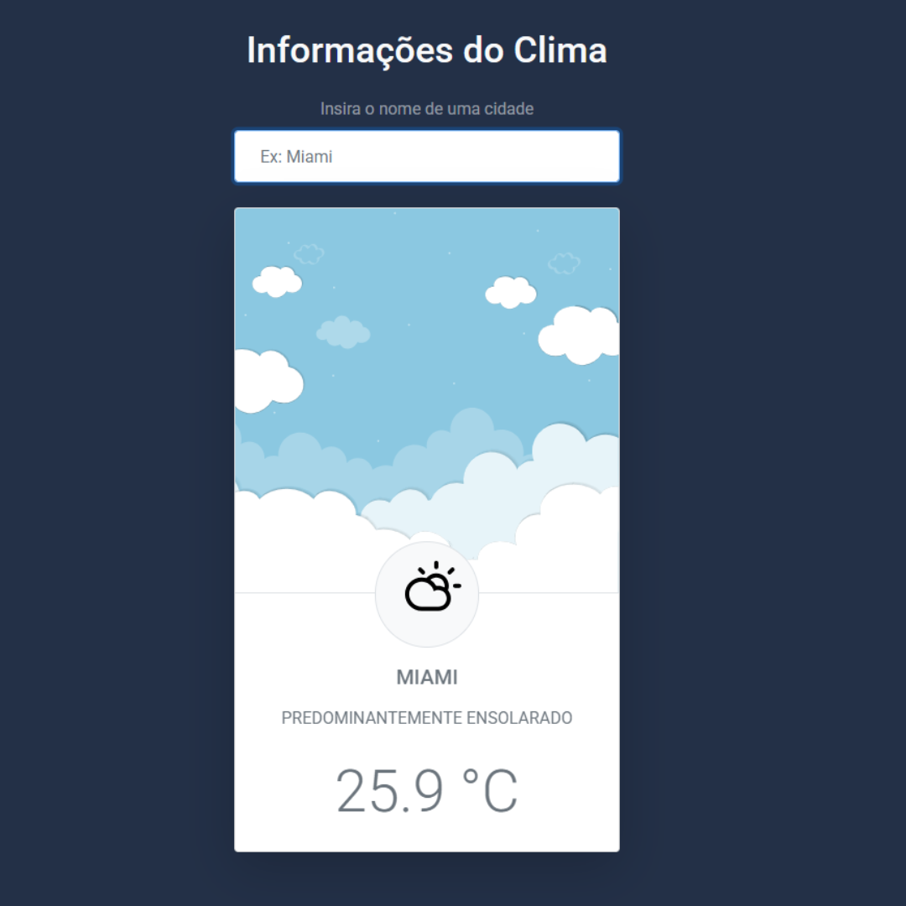

# Project title

App weather

# Tools used

Javascript + html + css

# Description

Api consumption with async/await fetch from accuweather server using good api consumption practices.
In the application you can search for the city you want to know the weather for and the application returns a text with the current weather and the temperature in degrees Celsius.

---

**Screen**

# Improvements

- Insert more user interactions.
- Improve color contrast.
- Cache latest searches.
